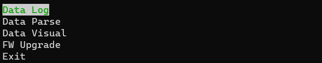

# 项目名称
Data Tool

## 项目简介
该工具用于IMU设备调试，测试。
目前支持的通信接口：
1. Uart
目前支持的功能：
1. 串口数据的记录与解析。（支持的包类型有:S1, S2, S3, A1, FM, AT）
2. 串口数据实时可视化输出。（支持输出：三轴加速度，三轴角速度）
3. 固件升级。（支持设备：IMU330BA）

## 安装说明
Python库：
matplotlib：$pip install -i https://pypi.tuna.tsinghua.edu.cn/simple matplotlib
curses: $pip install -i https://pypi.tuna.tsinghua.edu.cn/simple windows-curses

## 使用说明
程序运行后会生成以下界面，分别对应数据记录，数据解析，数据可视化和固件升级四个功能，使用'↑'和'↓'进行选择，'enter'选中进入。

以下是使用时需要注意的一些事项：
1. 在开始使用该工具前需要配置使用参数，如串口号，波特率等，配置方法为：
'Data Log'->'User Setting'/'Data Play'->'Data Setting'打开配置文件

（配置文件中的'maxt'是可显示数据的最大时间长度，'dt'是数据刷新的频率）
在配置完成后保存并关闭文件即可。

2. 解析数据时需要将数据名称改为以下格式（若解析的数据为此工具记录则不需要修改名称）
'device name'_'packet type'.bin，如果还需要加以其他后缀用以数据标识，需要用'_'将后缀隔开
例：'imu_S1_2008.bin'
